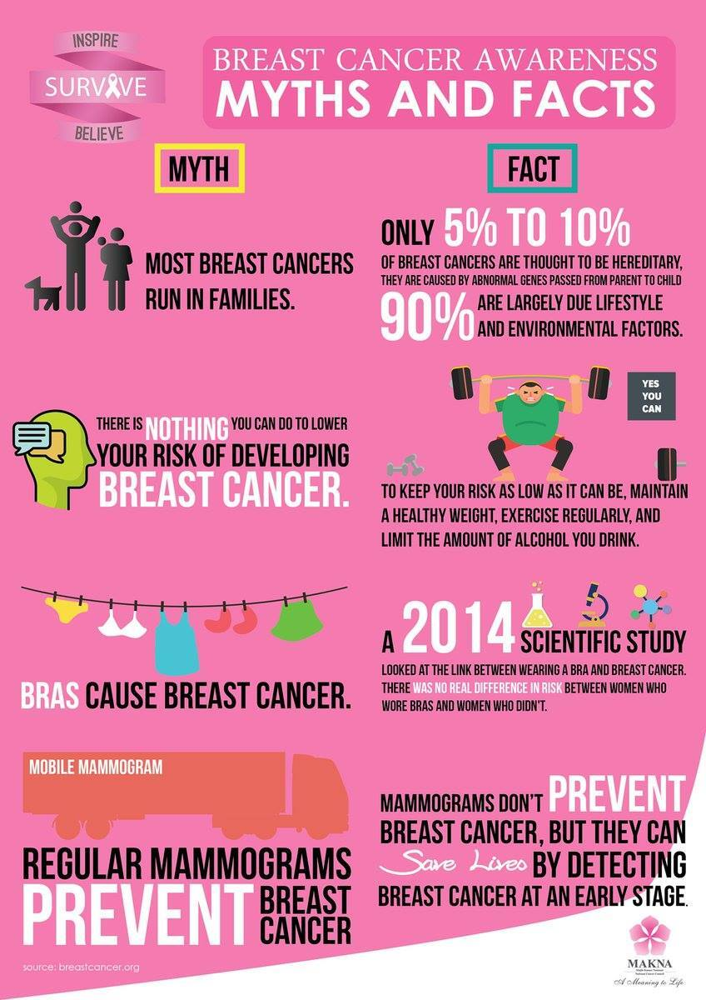
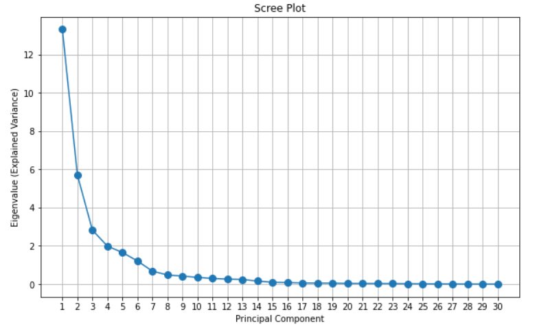
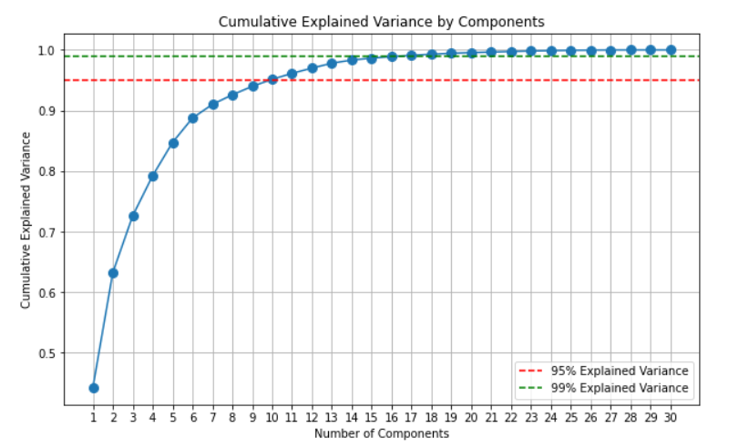
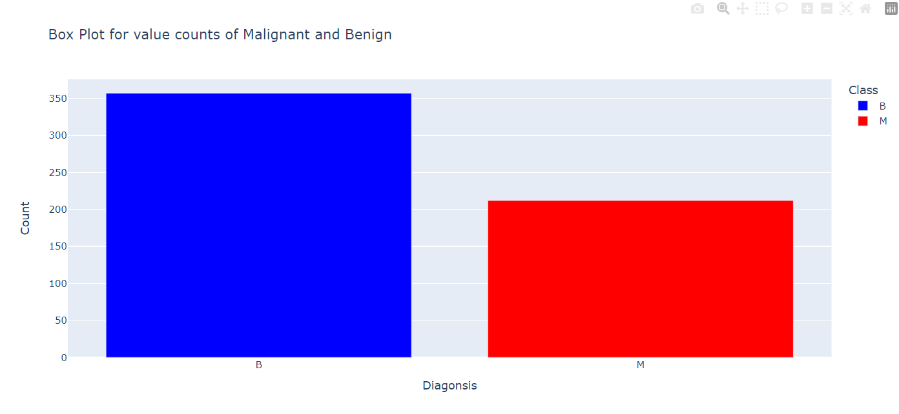
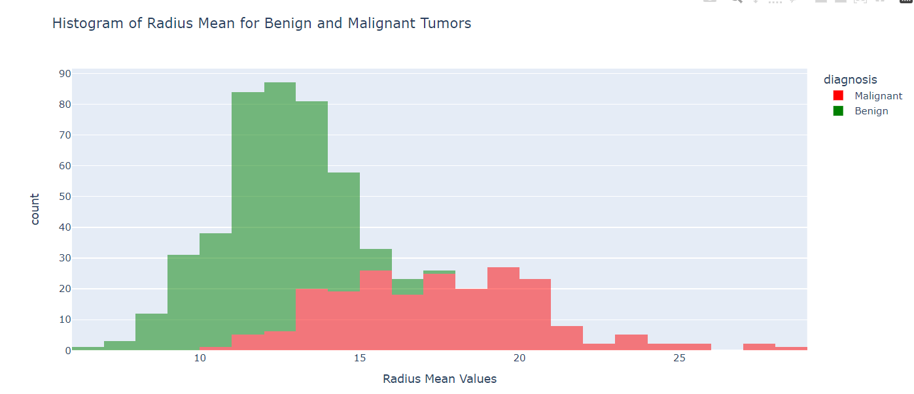
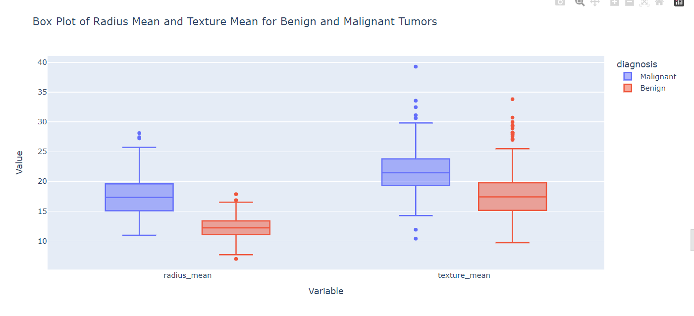
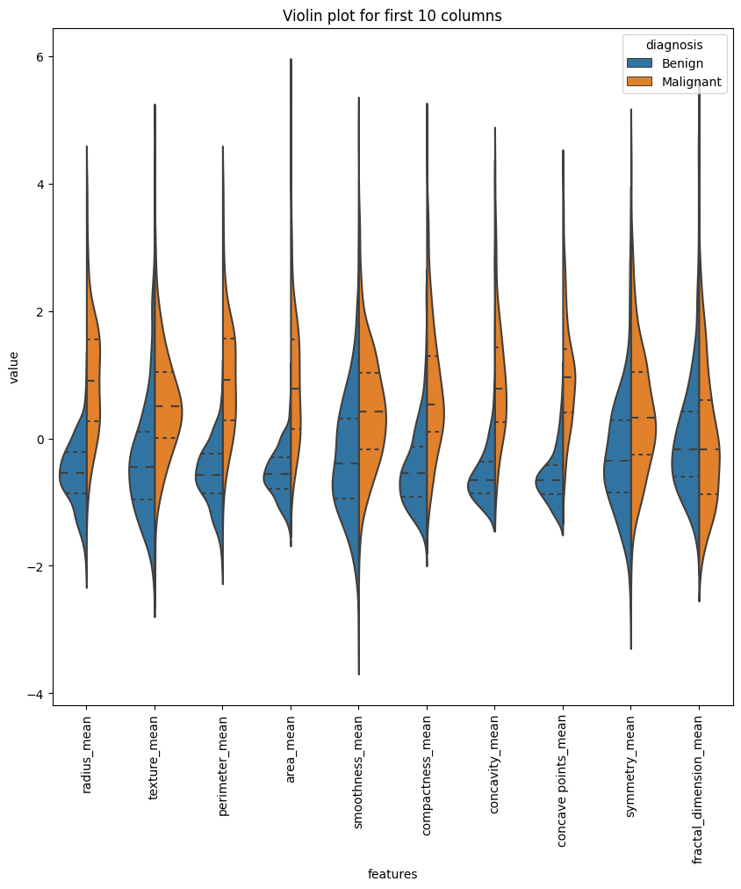
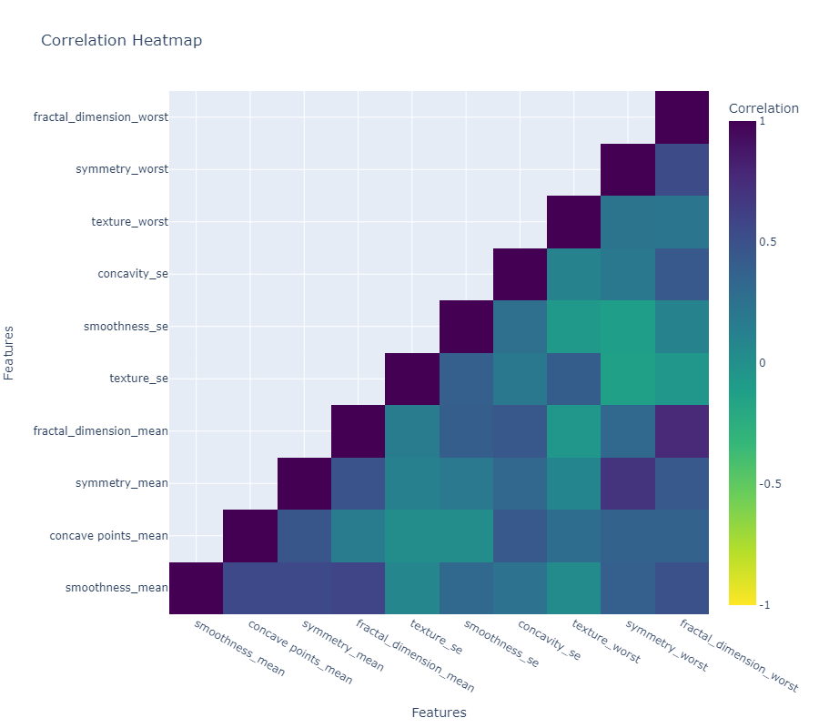

# 
 Breast Cancer Prediction 

##  Title and Author
- Project Title - **Breast Cancer Predection**
- Prepared for UMBC Data Science Master Degree Capstone by **Dr Chaojie (Jay) Wang**
- Author - **Kurre Sai Chand**
- Author's GitHub profile - https://github.com/saichandkurre
- Author's LinkedIn progile - www.linkedin.com/in/sai-chand-kurre
- PowerPoint presentation file -
- YouTube video -
##  Background

  

  

    

    
    

 

**Breast Cancer**
- Breast cancer is the most common cancer in women, accounting for one in every four cancer diagnoses in the United States and claiming the lives of over 40,000 people each year. It is also the second leading cause of cancer death in women, trailing only lung cancer. Breast cancer detection early is critical and can improve survival chances.
- Breast cancer is the most common type of cancer, and it has recently become one of the most commonly reported skin cancer types. The infographics above paint a clear picture of this cancer and its impact on modern society. Breast cancer is a current hot-button issue in the medical world. Our modern, sedentary lifestyle could be the primary cause. This type of cancer can affect both men and women, but women are twice as likely as men to develop breast cancer, according to scientific research. That is why detecting cancer in its early stages is critical.
- Breast cancer develops in the lining cells (epithelium) of the glandular tissue's ducts (85%) or lobules (15%). The cancerous growth is initially confined to the duct or lobule ("in situ"), where it usually causes no symptoms and has a low potential for spread (metastasis).
- As most of us are aware, cancer is defined as uncontrolled cell growth in a specific area. Based on an imaging procedure known as Fine Needle Aspiration, an expert will classify the cells as malignant or benign. However, how can machine learning be used to detect breast cancer? That is the pressing issue of the hour. Image processing techniques or manual measurements are used to measure cell characteristics from Fine Needle Aspiration images, and these characteristics are used to classify the cells as benign or cancerous.

  

  

    

    
    

 

**Why Does it Matter?**
- Early detection and treatment can increase survival rates, and less aggressive treatment methods can be used.
- Prevention and risk reduction, as well as targeted screening programs for high-risk populations, have the potential to reduce the death rate.

**Research questions?**
- Can we create a predictive model that accurately classifies tumors as malignant (M) or benign (B) based on the features provided (radius_mean, texture_mean, perimeter_mean, and so on)?
- Is there any evidence of strong correlations between features?

## Data
- **Data Source** : The data is found from UCI Machine Learning Repository https://archive.ics.uci.edu/dataset/17/breast+cancer+wisconsin+diagnostic
- **Data Size** : size of our data is 128 KB
- **Data Shape** : Our Data Set consists of 570 rows and 33 columns
- Features are computed from a digitized image of a fine needle aspirate (FNA) of a breast mass. They describe characteristics of the cell nuclei present in the image.
- **Data Dictionary** :
- 1 ID number
- 2 Diagnosis (M = malignant, B = benign)
- 3-33) Ten real-valued features are computed for each cell nucleus:
    - a) radius (mean of distances from center to points on the perimeter)
    - b) texture (standard deviation of gray-scale values)
    -  c) perimeter
    - d) area
    - e) smoothness (local variation in radius lengths)
    - f) compactness (perimeter^2 / area - 1.0)
    - g) concavity (severity of concave portions of the contour)
    - h) concave points (number of concave portions of the contour)
    - i) symmetry
    - j) fractal dimension
- The mean, standard error and "worst" or largest (mean of the three largest values) of these features were computed for each image, resulting in 30 columns.
- id is of datatype int64, diagnosis is of data type object and the rest of other 30 parameters are of Float64.
- **Target For ML Model** : Diagnosis
##	Potential Features/Predictors
- All columns except the target variable may have potential to be utilised as feature columns in machine learning models.
##	Exploratory Data Analysis (EDA)
- **Import Libraries**
  - Imported all thenecessary libraries such as  pandas, matplotlib, seaborn, plotly, and numpy.
  
- **Loading Data_set**
  - loaded the dataset which is in csv format into the jupyter Notebook as df, as data frame.
   
- **Cleaning Data**
	- knowing the datatypes 
	- knowing the shape of data
	- knowing all the column names
	- knowing the stastistical details about our data
	- Checking the null values
	- Deleting unwanted columns(Unnamed: 32 is the empty columns so that is deleted).
	- Checking whether any rows or columns are identical (no two columns or rows have same value)
	- Checking the number of categeorical values (there are 2 categorical values Bengin and melanin)

 
## Feature Engineering
-	Replace the values in the 'diagnosis' column to numerical labels.'Benign' is replaced with 0 and 'Malignant' is replaced with 1.
-	Generate meta data, This purpose is to provide a summary of important information about the columns in a given DataFrame. This summary aids in comprehending the dataset's structure and characteristics.
	### Scaling
	- Although feature scaling does not directly prevent overfitting, it is critical in maintaining consistency between training and testing datasets, improving model stability, and influencing the regularization process. These factors work together to produce models that are less prone to overfitting, resulting in better generalization to previously unseen data.
	### Normalization
	- Normalization is a data preprocessing technique used in statistics and machine learning that rescales numerical variables to a standard range. The process of transforming the features of a dataset to have a similar scale is known as normalization. This is important in various machine learning algorithms because it ensures that no single feature dominates due to its larger scale, preventing biases in the learning process of the model.
	-	Normalization methods vary, but Min-Max normalization is a popular approach that scales the data to a fixed range, typically [0, 1]. This is how Min-Max normalization works:
	1. Find the minimum (min) and maximum (max) values of the feature to be normalized.
	2. For each value in the feature, apply the following formula: normalized_value = (original_value - min)/(max - min)
	3. Using this formula, the original values are scaled between 0 and 1. If the original value is the minimum value, the normalized value is zero; if it is the maximum value, the normalized value is one.
	### Standardization
	- Another data preprocessing technique used in machine learning and statistics is standardization. Standardization, as opposed to normalization, rescales features to have the properties of a standard normal distribution with a mean of 0 and a standard deviation of 1. This is also known as z-score standardization or normalization.
	- Calculate the mean (μ) and standard deviation (σ) of the feature.
	- For each value in the feature, apply the following formula: Standardized_value = (original_value - μ)/σ
	- In this formula, the original values are scaled based on how far they deviate from the mean. A positive standardized value means that the original value is greater than the mean, while a negative value means that the original value is less than the mean.
	
	### Principle Component Analysis
	- Principal Component Analysis (PCA) is a dimensionality reduction technique widely used in machine learning and data analysis. Its primary goal is to retain as much information as possible while minimizing the number of features (or dimensions) in a dataset. PCA transforms the original features into a new set of uncorrelated features known as principal components. These main elements are orthogonal to one another and are linear combinations of the original features.
	1. **Variance:** PCA seeks to maximize data variance along the new dimensions. High variance indicates that the data points are dispersed and provide useful information.
	2. **Orthogonality:** The primary components are orthogonal, which means they are uncorrelated. This ensures that the new features capture a variety of data aspects.
	3. **Eigenvalues and Eigenvectors:** PCA entails determining the eigenvalues and eigenvectors of the original data's covariance matrix. Eigenvalues represent the amount of variance explained by each principal component, whereas eigenvectors represent the component's direction in the original feature space.
	#### Advantages of PCA:
	1. Dimensionality Reduction
	2. Noise Reduction
	3. Visualization
	                                                                                                             
	- Split the DataFrame into X (features) and y (target) and Initialize PCA with the specified number of components.
	- Fit PCA on the feature matrix (X) and gets the principle components and then Creates a DataFrame to store the principal components.
	- Initializes a dictionary to store top features for each principal component and Loop through each principal component then Select the top 'top_n' features.
	- Next, Creates a list of selected features by combining top features from all principal components and Calculates PCA variance explained and cumulative variance explained.
	- Plotting for both PCA variance and cumulative variance and the Creates a new DataFrame with selected features and the target column.
	

  

  

    

    
    

 

  

  

    

    
    

	- **After PCA the	Selected Columns are : ['symmetry_worst', 'concave points_mean', 'texture_worst', 'fractal_dimension_mean', 'fractal_dimension_worst', 'concavity_se', 'texture_se', 'smoothness_mean', 'smoothness_se', 'symmetry_mean']**
	
## Visualizations
- **Box Plot for value counts of Malignant and Benign to know the distribution of data**
  
  

  

  

    

    
    

 

- **Histogram of Radius Mean for Benign and Malignant Tumors**
  
  

  

  

    

    
    

 

- **Histogram of Smoothness Mean for Benign and Malignant Tumors**
  
  

  

  

    

    
    

 

- **Box Plot of Radius Mean and Texture Mean for Benign and Malignant Tumors**

  

  

    

    
    

 
 
- **Violin Plot of for first 10 rows to know more about the data**

  

  

    

    
    

 

- **Heat map for our final data**

  

  

    

    
    

 

## Machine Learning Models

- A comprehensive approach is taken in the pursuit of accurate and discernible cancer prediction through the use of six distinct machine learning models, each meticulously selected for its unique algorithmic prowess. Logistic Regression, known for its ease of use and interpretability, lays the groundwork by utilizing a linear approach to discern the intricate patterns within our dataset. K-Nearest Neighbor, a nuanced proximity analysis method, contributes discriminating capability, promising to reveal latent structures in the complex web of cancer-related attributes. Meanwhile, the Random Forest Classification algorithm, a decision tree ensemble, provides a robust and versatile framework capable of capturing intricate relationships while minimizing overfitting.

- Furthermore, using its prowess in high-dimensional spaces, the formidable Support Vector Classification attempts to carve optimal hyperplanes, intricately separating the intricacies of cancer manifestation. With its intuitive branching logic, the Decision Tree Classification aspires to decipher the underlying decision rules embedded within the intricate tapestry of our dataset. Gaussian Naive Bayes emerges as an eloquent method for probabilistic classification, relying on the foundational principles of Bayes' theorem and Gaussian distributions. It is particularly adept in scenarios where the independence assumption is reasonably maintained.

- This multifaceted collection of algorithms converges on a single goal: to meticulously determine the best predictive model for our cancer dataset. The comparative analysis, anchored in the pursuit of accuracy, will serve as a testing ground for these algorithms, revealing their respective merits and complexities. 

- The dataset, meticulously curated for our cancer prediction endeavor, is partitioned wisely, with 70% of its complexities allocated to the training domain and the remaining 30% reserved for the rigorous crucible of testing.
 
- We wisely used the sklearn library's formidable arsenal in crafting a strong framework for our machine learning endeavors. The train_test_split function from sklearn.model_selection focuses on optimal data utilization. In order to ensure a harmonious convergence of features within the machine learning models, the StandardScaler from sklearn.preprocessing was enlisted.

- A curated selection of algorithms was orchestrated for our predictive models. The venerable LogisticRegression from sklearn.linear_model provided linear interpretability, while the KNeighborsClassifier from sklearn.neighbors added a nuanced proximity analysis component. The RandomForestClassifier from sklearn.ensemble provided a robust approach for navigating the intricate web of cancer-related attributes.

- In the field of support vector classification, the SVC from sklearn.svm demonstrated its prowess in high-dimensional spaces, identifying optimal hyperplanes among the complexities of cancer manifestation. The DecisionTreeClassifier from sklearn.tree's inherently intuitive decision logic was used to decipher underlying decision rules. Meanwhile, the GaussianNB from sklearn.naive_bayes was used for nuanced probabilistic classification while embracing the Gaussian assumption.

- Following model predictions, a meticulous examination of performance was facilitated by the prudent use of metrics obtained from sklearn.metrics. The triumvirate of accuracy_score, classification_report, and confusion_matrix emerged as indispensable companions, providing insights into the accuracy scores, detailed classification reports, and the intricate nuances encapsulated within the confusion matrix.

- My primary development environment is my personal laptop. In addition, I use Google Colab for collaborative projects and when I need access to more computational resources. I also use GitHub CodeSpaces because it integrates seamlessly with version control and collaborative coding. 

- I will use a combination of relevant evaluation metrics tailored to the nature of the problem and the characteristics of our dataset to measure and compare the performance of the models. Accuracy, precision, recall, F1 score, and the confusion matrix will be among these metrics.

## Application of the Trained Model

- We have meticulously developed a user-friendly webpage leveraging the cutting-edge capabilities of the Streamlit platform, putting us at the forefront of healthcare technology. This dynamic interface acts as a portal for accurate breast cancer prediction, leveraging the formidable prowess of the Random Forest Classifier algorithm. Users can receive real-time predictions distinguishing between benign and malignant conditions by inputting essential details such as radius, texture, smoothness, and compactness.

- Our website goes beyond simple diagnostic capabilities to extend a compassionate hand by providing personalized guidance. Users gain access to a wealth of knowledge in addition to predictive insights. The platform recommends tailored treatment methods, allowing individuals to make informed decisions on their road to recovery. Furthermore, a curated list of suggested foods is provided, with the goal of boosting resilience and supplementing the specific needs dictated by the nature of the cancer.

- This comprehensive approach not only bridges the diagnostic gap but also fosters a supportive ecosystem, demonstrating our commitment to providing individuals with the tools and knowledge they need to navigate the complexities of breast cancer. Our Streamlit-powered website is a testament to the seamless integration of advanced technology, medical insights, and compassionate care, paving the way for informed decisions and resilient health outcomes.

## Conclusion

- We used six cutting-edge machine learning algorithms in our comprehensive project, including Logistic Regression, K-Nearest Neighbor, Random Forest Classification, Support Vector Classification, Decision Tree Classification, and Gaussian Naive Bayes. These algorithms were rigorously tested for breast cancer prediction on our Streamlit-powered website. Users can seamlessly enter specific details, and our system uses these algorithms dynamically to provide real-time predictions, distinguishing between benign and malignant conditions.

- The use of multiple machine learning models demonstrates our dedication to achieving the highest predictive accuracy and robustness. We ensured that our predictive tool not only excels in diagnostic precision but also goes above and beyond by offering personalized treatment suggestions and dietary recommendations through a rigorous evaluation process. 

## Limitations

- While our project represents an important step forward in breast cancer prediction and personalized guidance, it is critical to recognize its limitations. To begin, our models' predictive accuracy is dependent on the quality and representativeness of the training data. Any biases or gaps in the dataset could have an impact on the model's performance and generalizability.

- Our system is based on the assumption of feature independence. However, in real-world scenarios, features may have complex interdependencies that this assumption does not account for.

- The predictive capabilities of our platform are dependent on the completeness and accuracy of the input data provided by users. Incomplete or inaccurate data may result in suboptimal predictions.

- Our current system focuses solely on breast cancer prediction and offers general treatment and dietary advice. It does not take into account individual differences in patient history, genetic factors, or other co-occurring health conditions, limiting the personalization of the advice provided.

## Leasons Learned

- We've discovered the critical importance of meticulous data preprocessing. The predictive accuracy of our models is greatly influenced by the quality and representativeness of our training data. We recognize the importance of thorough data exploration, cleansing, and validation in order to reduce biases and improve the robustness of our system.

- Each algorithm has advantages and disadvantages, and our iterative experimentation process has highlighted the importance of matching model choices to the unique characteristics of our dataset.  

- We've learned to adopt an agile development mindset, which allows for greater flexibility and adaptability. Our ability to pivot and iterate has been a key driver of progress as we faced unexpected challenges or opportunities for improvement.

## Future Research

-  Future research could focus on improving the personalization aspect of our predictive models. Individual patient histories, genetic data, and lifestyle factors could be used to further tailor treatment and dietary recommendations, resulting in a more precise and patient-centric approach.

- Investigating the integration of advanced technologies such as deep learning or neural networks could open up new avenues for predictive accuracy and feature representation.

-  Incorporating real-time data streams, such as continuous monitoring of health metrics or data from wearable devices, could improve the dynamic nature of our predictive models.

- Although our current project is focused on breast cancer, there is plenty of room to expand the predictive models to other types of cancer. 

- Future research should also address the ethical and regulatory implications of deploying predictive healthcare models. 

## References

- https://statisticsbyjim.com/basics/principal-component-analysis/

- https://www.geeksforgeeks.org/understanding-logistic-regression/

- https://towardsdatascience.com/machine-learning-basics-with-the-k-nearest-neighbors-algorithm-6a6e71d01761

- https://scikit-learn.org/stable/modules/generated/sklearn.ensemble.RandomForestClassifier.html

- https://scikit-learn.org/stable/modules/svm.html

- https://www.coursera.org/articles/decision-tree-machine-learning
