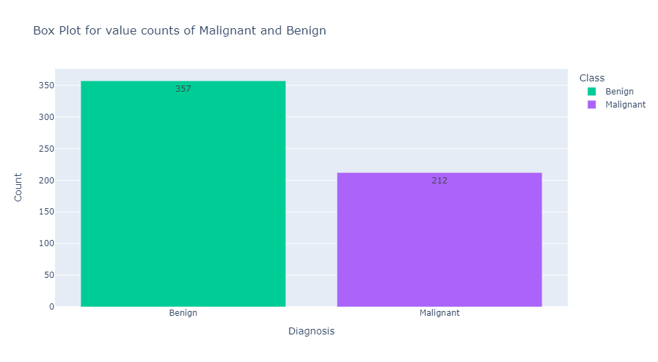

# 
 Breast Cancer Prediction 

##  Title and Author
- Project Title - **Breast Cancer Predection**
- Prepared for UMBC Data Science Master Degree Capstone by **Dr Chaojie (Jay) Wang**
- Author - **Kurre Sai Chand**
- Author's GitHub profile - https://github.com/saichandkurre
- Author's LinkedIn progile - www.linkedin.com/in/sai-chand-kurre
- PowerPoint presentation file -
- YouTube video -
##  Background

  

  

    

    
    

 

**Breast Cancer**
- Breast cancer is the most common cancer in women, accounting for one in every four cancer diagnoses in the United States and killing over 40,000 people each year. It is also, after lung cancer, the second leading cause of cancer death in women. Early detection of breast cancer is critical and can improve survival chances.
- Breast cancer is the most common cancer, and it is one of the most commonly reported skin cancer types in recent years. The infographics above provide a clear picture of this cancer and its impact on the modern world. Breast Cancer is a current hot-buttom issue in the world of healthcare. The main reason could be our modern, sedentary lifestyle. This type of cancer can affect both men and women, but according to scientific research, women are twice as likely as men to develop breast cancer. That is why it is critical to detect cancer in its early stages.
- Breast Cancer arises in the lining cells (epithelium) of the ducts (85%) or lobules (15%) in the glandular tissue of the breast. Initially, the cancerous growth is confined to the duct or lobule (“in situ”) where it generally causes no symptoms and has minimal potential for spread (metastasis).
- Cancer, as most of us know, is defined as uncontrolled cell growth in a specific area. An expert will classify the cells as malignant or benign based on an imaging procedure known as Fine Needle Aspiration. But how can machine learning be used to diagnose breast cancer? That is the burning question of the hour. Cell characteristics are measured from Fine Needle aspiration images using image processing techniques or manual measurements, and these characteristics are used to classify the cells as benign or cancerous.

  

  

    

    
    

 

**Why Does it Matter?**
- For Early Detection and treatment which helps in increasing the survival rates and less aggressive treatment methods can be applied.
- Prevention and the risk reduction and targeted screening programs for high-risk populations might reduce the death rate.

**Research questions?**
- Can we develop a predictive model that accurately classifies tumors as malignant (M) or benign (B) based on the given features (radius_mean, texture_mean, perimeter_mean, etc.)?
- Are there any strong correlations between pairs of features?

## Data
- **Data Source** : The data is found from UCI Machine Learning Repository https://archive.ics.uci.edu/dataset/17/breast+cancer+wisconsin+diagnostic
- **Data Size** : size of our data is 128 KB
- **Data Shape** : Our Data Set consists of 570 rows and 33 columns
- Features are computed from a digitized image of a fine needle aspirate (FNA) of a breast mass. They describe characteristics of the cell nuclei present in the image.
- **Data Dictionary** :
- 1 ID number
- 2 Diagnosis (M = malignant, B = benign)
- 3-33) Ten real-valued features are computed for each cell nucleus:
    - a) radius (mean of distances from center to points on the perimeter)
    - b) texture (standard deviation of gray-scale values)
    -  c) perimeter
    - d) area
    - e) smoothness (local variation in radius lengths)
    - f) compactness (perimeter^2 / area - 1.0)
    - g) concavity (severity of concave portions of the contour)
    - h) concave points (number of concave portions of the contour)
    - i) symmetry
    - j) fractal dimension
- The mean, standard error and "worst" or largest (mean of the three largest values) of these features were computed for each image, resulting in 30 columns.
- id is of datatype int64, diagnosis is of data type object and the rest of other 30 parameters are of Float64.
- **Target For ML Model** : Diagnosis
## Potential Features/Predictors
- All columns except the target variable may have potential to be utilised as feature columns in machine learning models.
## Exploratory Data Analysis (EDA)
- **Import Libraries**
  - Imported all thenecessary libraries such as  pandas, matplotlib, seaborn, plotly, and numpy.
  
- **Loading Data_set**
  - loaded the dataset which is in csv format into the jupyter Notebook as df, as data frame.
   
- **Cleaning Data**
	- knowing the datatypes 
	- knowing the shape of data
	- knowing all the column names
	- knowing the stastistical details about our data
	- Checking the null values
	- Deleting unwanted columns(Unnamed: 32 is the empty columns so that is deleted).
	- Checking whether any rows or columns are identical (no two columns or rows have same value)
	- Checking the number of categeorical values (there are 2 categorical values Bengin and melanin)

 
## Feature Engineering
-	Replace the values in the 'diagnosis' column to numerical labels.'Benign' is replaced with 0 and 'Malignant' is replaced with 1.
-	Generate meta data, This purpose is to provide a summary of important information about the columns in a given DataFrame. This summary aids in comprehending the dataset's structure and characteristics.
	### Scaling
	- feature scaling itself does not directly prevent overfitting, it plays a crucial role in maintaining consistency between the training and testing datasets, improving model stability, and influencing the regularization process. These factors collectively contribute to creating models that are less prone to overfitting, leading to better generalization to unseen data.
  ### Normalization
 - Normalization is a statistical and machine learning data preprocessing technique that rescales numerical variables to a standard range. Normalization is the process of transforming a dataset's features to have a similar scale. This is important in various machine learning algorithms because it ensures that no single feature dominates due to its larger scale, thereby preventing biases in the model's learning process.
  -	Normalization methods vary, but one popular approach is Min-Max normalization, which scales the data to a fixed range, typically [0, 1]. The following is how Min-Max normalization works:
	-	1. Find the minimum (min) and maximum (max) values of the feature to be normalized.
	-	2. For each value in the feature, apply the following formula: normalized_value = (original_value - min)/(max - min)
	-	3. Using this formula, the original values are scaled between 0 and 1. If the original value is the minimum value, the normalized value is zero; if it is the maximum value, the normalized value is one.
  ### Standardization
= Standardization is another data preprocessing technique used in machine learning and statistics. In contrast to normalization, standardization rescales features to have the properties of a standard normal distribution with a mean of 0 and a standard deviation of 1. This is also known as z-score normalization or standardization.
- Calculate the mean (μ) and standard deviation (σ) of the feature.
- For each value in the feature, apply the following formula: Standardized_value = (original_value - μ)/σ
- he original values are scaled based on how far they deviate from the mean in this formula. A positive standardized value indicates that the original value is greater than the mean, whereas a negative value indicates that the original value is less than the mean.
	
### Principle Component Analysis
- Principal Component Analysis (PCA) is a technique for reducing dimensionality that is widely used in machine learning and data analysis. Its main goal is to keep as much information as possible while reducing the number of features (or dimensions) in a dataset. The original features are transformed into a new set of uncorrelated features known as principal components by PCA. These principal components are orthogonal to each other and are linear combinations of the original features.
- 1. Variance: PCA seeks to maximize data variance along the new dimensions. High variance indicates that the data points are dispersed and provide useful information.
- 2. Orthogonality: The primary components are orthogonal, which means they are uncorrelated. This ensures that the new features capture a variety of data aspects.
- 3. Eigenvalues and Eigenvectors:PCA entails determining the eigenvalues and eigenvectors of the original data's covariance matrix. Eigenvalues represent the amount of variance explained by each principal component, whereas eigenvectors represent the component's direction in the original feature space.
#### Advantages of PCA:
- 1. Dimensionality Reduction
- 2. Noise Reduction
- 3. Visualization
	- Split the DataFrame into X (features) and y (target) and Initialize PCA with the specified number of components.
	- Fit PCA on the feature matrix (X) and gets the principle components and then Creates a DataFrame to store the principal components.
	- Initializes a dictionary to store top features for each principal component and Loop through each principal component then Select the top 'top_n' features.
	- Next, Creates a list of selected features by combining top features from all principal components and Calculates PCA variance explained and cumulative variance explained.
	- Plotting for both PCA variance and cumulative variance and the Creates a new DataFrame with selected features and the target column.
	

  

  

    

    
    

 

  

  

    

    
    

	- After PCA the	Selected Columns are : ['symmetry_worst', 'concave points_mean', 'texture_worst', 'fractal_dimension_mean', 'fractal_dimension_worst', 'concavity_se', 'texture_se', 'smoothness_mean', 'smoothness_se', 'symmetry_mean']
	
### visualization
- Box Plot for value counts of Malignant and Benign to know the distribution of data
  
  

  

  

    

    
    

 

- Histogram of Radius Mean for Benign and Malignant Tumors
  
  

  

  

    

    
    

 

- Histogram of Smoothness Mean for Benign and Malignant Tumors
  
  

  

  

    

    
    

 

- Box Plot of Radius Mean and Texture Mean for Benign and Malignant Tumors

  

  

    

    
    

 
 
- violin Plot of for first 10 rows to know more about the data

  

  

    

    
    

 

- Heat map for our final data

  

  

    

    
    

 
