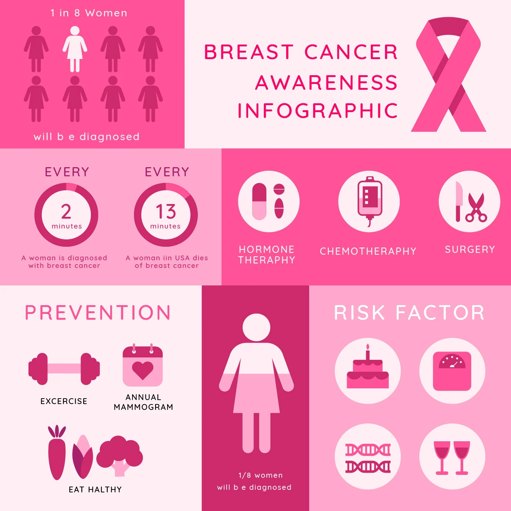
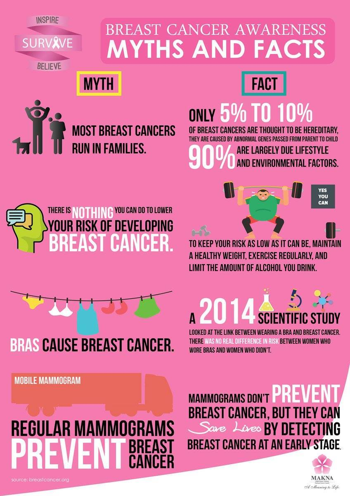

< p align ='center' > Breast Cancer Predection 

##  Title and Author
- Project Title - Breast Cancer Predection
- Prepared for UMBC Data Science Master Degree Capstone by Dr Chaojie (Jay) Wang
- Author - Kurre Sai Chand
- Author's GitHub profile - 
- Author's LinkedIn progile - 
- PowerPoint presentation file -
- YouTube video -
##  Background

  

  

    

    
    

 

**Breast Cancer**
- Breast cancer is the most common cancer in women, accounting for 1 in 4 cancers diagnosed in the U.S. and causing over 40,000 deaths each year. It is also the second leading cause of cancer death in women, after lung cancer. Early detection of breast cancer is key and can help improve the chances of survival.
- Breast Cancer is the most common cancer and its very highly reporting skin cancer types in recent times. Above infographics give clear idea about this cancer and its impact on current world. In the world of healthcare, Breast Cancer is a current hot-buttom issue. Our modern and lathergic lifestyle could be main reason. This type of cancer can occur in both men and women, but as per scientific investigation, Women are 2X susceptible to Breast Cancer Which is why it is important to diagnose cancer in early stages.
- Breast Cancer arises in the lining cells (epithelium) of the ducts (85%) or lobules (15%) in the glandular tissue of the breast. Initially, the cancerous growth is confined to the duct or lobule (“in situ”) where it generally causes no symptoms and has minimal potential for spread (metastasis).
- As most of us know cancer is uncontrolled growth of the cells in a given area. Based on imaging proceduce called Fine Needle Aspiration proceducre, an expert will classify the cells as malignant,or benign. But How can we diagnosis breast cancer with machine learning? Thats question of the hour.
With image processing techniqes or manual measurements, cell charateristics are measured from Fine Needle aspiration images, and this characteistics will be used to classifiy the cells in to Benign and Cancerous.

  

  

    

    
    

 

- Can we develop a predictive model that accurately classifies tumors as malignant (M) or benign (B) based on the given features (radius_mean, texture_mean, perimeter_mean, etc.)?
- Are there any strong correlations between pairs of features?
